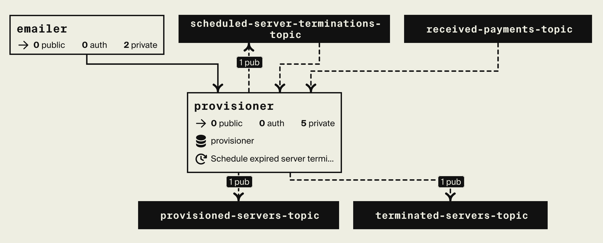

# Valhala RaceRoom Dedicated Servers

[RaceRoom](https://game.raceroom.com/) is a well known racing simulator used in variety of competitions.

This repo has been created as a proof of concept for purchasing on-demand time-based multiplayer dedicated servers
which could be used for online multiplayer sessions.

Currently, it supports (is hard coded to) a single type of RaceRoom dedicated server hosted on aws but can 
easily be extended to handle all kinds of games / servers.

## Encore Implementation
The whole solution is built using [Encore](https://encore.dev/) and showcases the following:
- How to server server-side static content 
- Encore services communicating via async and sync interfaces
- Usage of Encore Transactional Outbox for reliable message publishing 
- How [sqlboiler](https://github.com/volatiletech/sqlboiler) can be used with Encore. 
- How one can combine Encore, sqlboiler and outbox pattern in atomic vay using [tx](https://github.com/aneshas/tx) go package
- Using Encore Cron Jobs in combination with pubsub for async job scheduling 
- Using external services with Encore (eg. smtp, cloud providers, payment providers)

## Encore Hackathon
The project is still in test mode (sandbox payments) since it is in active development,
but for the purposes of hackathon - real `aws` server instances are provisioned after 
successful payments! - **This will stay on for the duration of the hackathon.**

Click [here](https://staging-raceroom-mtdi.encr.app/shop/) to access the shop.
